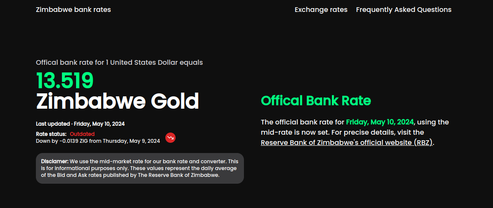

# [Zimbabwe bank rates](https://zimbabwe-bank-rates.vercel.app/)

## Description

An open source platform to stay updated with up-to-date ZiG bank rates and explore seamless currency conversions.

[](https://zimbabwe-bank-rates.vercel.app/)

## Tech Stack

- [Next.js](https://nextjs.org)
- [PostgreSQL](https://www.postgresql.org/)
- [Tailwind CSS](https://tailwindcss.com)
- [Shadcn](https://ui.shadcn.com/)

### Running Locally

### Dependencies

- PostgreSQL
- Docker (required soon)

### 1. Clone the repository

```bash
git clone https://github.com/icep0ps/zimbabwe-bank-rates.git
```

### 2. Install dependencies

```bash
npm install
```

### 3. Create a `.env.local` & `.env.production` file

Create a `.env.local` & `.env.production` file in the root directory and add the environment variables as shown in the `.env.local.example` & `.env.production.example` file.

### 4. Run the application

```bash
npm run dev
```

## Contributing

Contributions are welcome! Please open an issue if you have any questions or suggestions. Your contributions will be acknowledged. See the [contributing guide](./CONTRIBUTING.md) for more information.
